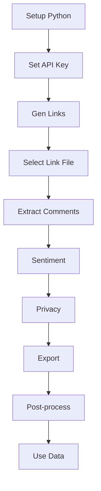

# Wisesight-Sentiment-Corpus-Thai

<p align="center">
  
</p>

## 📑 Table of Contents
- [Project Overview](#project-overview)
- [Quick Start](#quick-start)
- [Full Workflow](#full-workflow)
- [Privacy & Compliance](#privacy--compliance)
- [Export Formats](#export-formats)
- [Batch & Platform Support](#batch--platform-support)
- [Troubleshooting & FAQ](#troubleshooting--faq)
- [File/Folder Structure](#filefolder-structure)
- [Contact & Support](#contact--support)

---

## Project Overview
ชุดเครื่องมือดึงคอมเมนต์และวิเคราะห์ Sentiment ภาษาไทยจาก YouTube, Pantip ฯลฯ แบบ batch พร้อมฟีเจอร์ privacy, export หลายรูปแบบ, รองรับงานวิจัย/ML/ธุรกิจ และใช้งานง่ายผ่าน CLI

---

## Quick Start
1. **ติดตั้ง dependencies** (Python 3.8+):
   ```bash
   pip install -r requirements.txt
   ```
2. **ตั้งค่า Google API Key** สำหรับ YouTube Data API v3 ใน `.env` (เช่น `YOUTUBE_API_KEY=...`)
3. **สร้างไฟล์ลิงก์วิดีโอ YouTube**
   ```bash
   python url_crack_youtube.py
   # จะได้ไฟล์ youtube_real_links_1500.txt หรือ youtube_real_links_podcast.txt
   ```
4. **ดึงคอมเมนต์ + วิเคราะห์ sentiment + export**
   ```bash
   python app.py --from_file youtube_real_links_1500.txt --sentiment ml --privacy mask --export_format jsonl
   ```

---

## Full Workflow
1. **Generate YouTube links**: `python url_crack_youtube.py`
2. **Batch comment extraction**: `python app.py --from_file youtube_real_links_1500.txt`
3. **Advanced sentiment analysis**: `--sentiment ml` (ML/ensemble)
4. **Privacy management**: `--privacy mask` (hash author, mask PII) หรือ `--privacy remove`
5. **Export format**: `--export_format jsonl|csv|txt`
6. **Post-processing** (optional):
   ```bash
   cat youtube_comments_batch_*.jsonl > all_comments.jsonl
   python data_utils.py --input all_comments.jsonl --output all_comments.csv --format csv
   ```

---

## Privacy & Compliance
- `--privacy mask` : hash author, mask PII (ชื่อ, เบอร์, อีเมล, ฯลฯ)
- `--privacy remove` : remove author, mask PII
- ทุก record จะมี `privacy_notice` อธิบายมาตรการ privacy
- **แนะนำ**: ใช้ privacy mode ทุกครั้งที่ export ข้อมูลจริง

---

## Export Formats
- **JSONL**: เหมาะกับงาน ML, ข้อมูลขนาดใหญ่
- **CSV**: ใช้งานทั่วไป, เปิดใน Excel ได้
- **TXT**: ข้อความล้วน

---

## Batch & Platform Support
- **YouTube**: batch จากไฟล์ลิงก์, หลายวิดีโอ, API+scraper fallback
- **Pantip**: หลายกระทู้, batch
- **File**: รวมหลายไฟล์, post-process
- **ตัวอย่างคำสั่ง**:
  ```bash
  python get_comments.py pantip "43494778" "TOPIC_ID2" --include_advanced_sentiment
  python get_comments.py youtube "VIDEO_ID1" "VIDEO_ID2" --max_results 100
  python get_comments.py --from_file youtube_real_links_podcast.txt --advanced_sentiment --export_format jsonl
  python get_comments.py file "data1.jsonl" "data2.jsonl" --format csv
  ```

---

## Troubleshooting & FAQ
- **Transformer error**: ระบบตั้ง `max_length=512, truncation=True` ไว้แล้ว
- **YouTube API quota หมด**: ระบบ fallback เป็น scraper อัตโนมัติ
- **Privacy**: ใช้ privacy mode ทุกครั้งที่ export ข้อมูลจริง
- **ดู workflow ตัวอย่าง**: README นี้

---

## File/Folder Structure
- `app.py` : Main CLI (batch extraction, privacy, export)
- `ml_sentiment_analysis.py` : Sentiment ML/ensemble
- `url_crack_youtube.py` : Generate YouTube link batch
- `get_comments.py` : Legacy CLI, multi-platform
- `data_utils.py` : Post-processing, format conversion
- `youtube_real_links_1500.txt`, `youtube_real_links_podcast.txt` : Batch link files
- `youtube_comments_batch_1.jsonl` : Output example
- `/data/` : (ถ้ามี) เก็บ output, batch
- `.env` : API keys
- `README.md` : Documentation

---

## Contact & Support
- **สอบถาม/ปรับแต่ง workflow เพิ่มเติม แจ้งได้เลย!**
- [MULTIPLE_URLS_SUCCESS.md](MULTIPLE_URLS_SUCCESS.md) (รายละเอียดการใช้งาน batch/multi-URL)

---

## 🧠 Workflow Summary



**คำอธิบายขั้นตอน (ภาษาไทย):**
1. เตรียม Python และติดตั้ง dependencies
2. ตั้งค่า API Key ใน .env
3. สร้างไฟล์ลิงก์วิดีโอ YouTube
4. เลือกไฟล์ลิงก์ที่ต้องการ
5. ดึงคอมเมนต์แบบ batch
6. วิเคราะห์ sentiment
7. จัดการ privacy
8. Export ข้อมูล
9. Post-process (รวมไฟล์, แปลง format)
10. นำข้อมูลไปใช้งานต่อ (ML, วิจัย, วิเคราะห์)

---